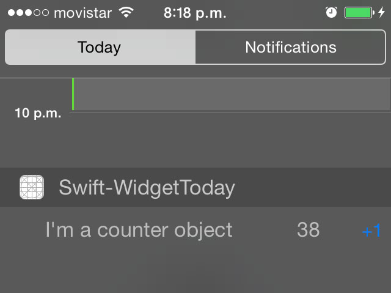

Swift-Widget
============

iOS application written in Swift implementing an iOS 8 Today Extension sharing data with container app through Core Data.

There are various examples implementing today extensions but i couldn't find one that used Core Data to read and write in the today extension so this is my approach, feel free to provide feedback and pull requests. Thanks!

## Implements
- App Groups
- Core Data when two processes read and write to the same .sqlite
- Custom Framework
- Today Extension

## Requirements

- Xcode 6
- iOS 8

## Author

Paul Chavarria, <a href="http://www.twitter.com/pjchavarria"> @pjchavarria </a>

## License

Swift-Widget is available under the MIT license. See the LICENSE file for more info.
